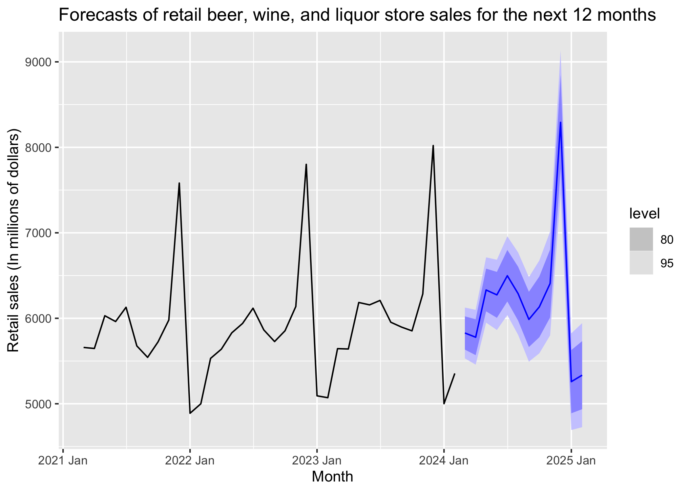

# Forecasting US beer, wine, and liqour store sales

A repository for automated forecasting of US beer, wine, and liquor
store sales using an ETS model.

## ETS model forecasts for the next 12 months

| Month    | Forecast (millions of dollars) | 95% Prediction Interval |
|:---------|:-------------------------------|:------------------------|
| 2023 Oct | 5932.35                        | (5628.91, 6235.80)      |
| 2023 Nov | 6174.64                        | (5830.47, 6518.80)      |
| 2023 Dec | 8007.14                        | (7522.54, 8491.74)      |
| 2024 Jan | 5092.21                        | (4758.82, 5425.59)      |
| 2024 Feb | 5126.30                        | (4764.58, 5488.03)      |
| 2024 Mar | 5751.90                        | (5316.02, 6187.77)      |
| 2024 Apr | 5699.83                        | (5237.55, 6162.11)      |
| 2024 May | 6225.70                        | (5687.04, 6764.37)      |
| 2024 Jun | 6180.94                        | (5612.15, 6749.73)      |
| 2024 Jul | 6410.49                        | (5784.87, 7036.11)      |
| 2024 Aug | 6176.07                        | (5538.54, 6813.59)      |
| 2024 Sep | 5858.29                        | (5220.26, 6496.32)      |

## Data & methodology

### Background

The United States Census Bureau releases a report each month of monthly
estimates of retail sales for a variety of business sectors. One
particular estimate that is released is an estimate of monthly retail
sales for beer, wine, and liquor stores. This data series has
historically displayed a very predictable trend and seasonal pattern,
suggesting that it can be predicted by time series forecasting methods.

### The data

The US retail beer, wine, and liquor stores sales data is given as total
sales in millions of dollars. Only retail sales data going back to 2010
is considered. This cutoff was arbitrarily chosen so that older data
didn’t have an impact on the model estimates.

### Tools

The sales data is pulled from fred.com API using the `fredr` R package.
The `fable` package is then used to fit the time series models and
generate forecasts. The sales data and forecasts for sales are stored in
an SQLite database\*.

\**Note*: The US Census Bureau will revise it’s estimates for previous
months as new releases become available. The way I’ve decided to handle
this is to update the observations themselves for the revised estimates
when computing forecasting evaluations. However, the forecasts
themselves do not get updated as they are based only on data available
at the time of the forecast.

### Forecasting Workflow

The primary model for forecasting beer, wine, and liquor store sales is
an ETS model on the log transform of sales. This model is automatically
selected each month according to AIC using the automated model selection
algorithm available in the `fable` package. A seasonal naive model
(which is simply the observation from the previous year for a given
month) and is also fit and considered as a benchmark.

The general forecasting workflow for a given data release can be
summarized in the following steps:

- Retail sales data going back to 2010 is pulled from fred.com.
- The ETS model is re-estimated on the data to account for new
  observations in the data release.
  - The benchmark seasonal naive model is also re-estimated at this
    step.
- The model and benchmark models are saved and ETS forecasts for the
  next 12 months are generated and stored in the SQLite database.
- A plot and summary of the ETS forecasts for the next 12 months are
  generated.
- Forecast accuracy metrics are recomputed to account for the new data.
- The README is re-rendered with the updated plots and accuracy metrics.

## Forecasts evaluation

### Overall accuracy measures for 1 to 12-month ahead forecasts

| Model  | Forecasting Periods |        ME |      MAE |     MAPE |     RMSE |       ACF1 |
|:-------|--------------------:|----------:|---------:|---------:|---------:|-----------:|
| ets    |                   6 | -37.53706 | 107.5895 | 1.788729 | 125.9314 | -0.1029505 |
| snaive |                   6 | 150.52381 | 150.5238 | 2.486152 | 172.9741 | -0.0406400 |

## References

U.S. Census Bureau, Retail Sales: Beer, Wine, and Liquor Stores
(MRTSSM4453USN), retrieved from FRED, Federal Reserve Bank of St. Louis;
<https://fred.stlouisfed.org/series/MRTSSM4453USN>, May 18, 2023.
